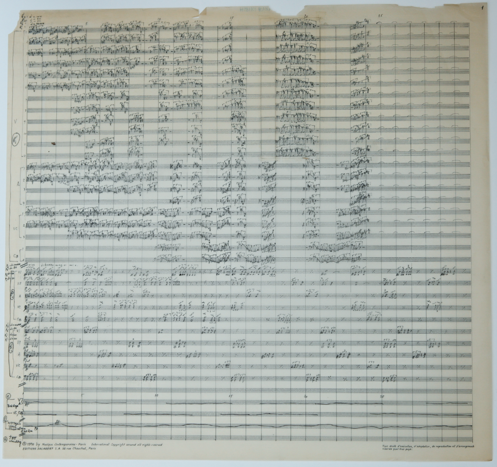
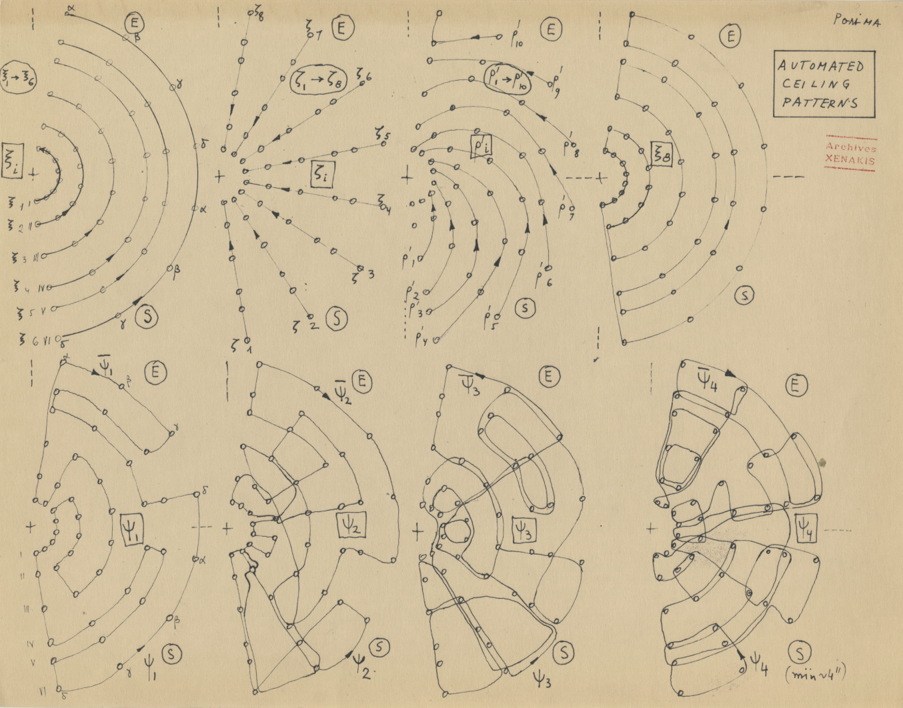
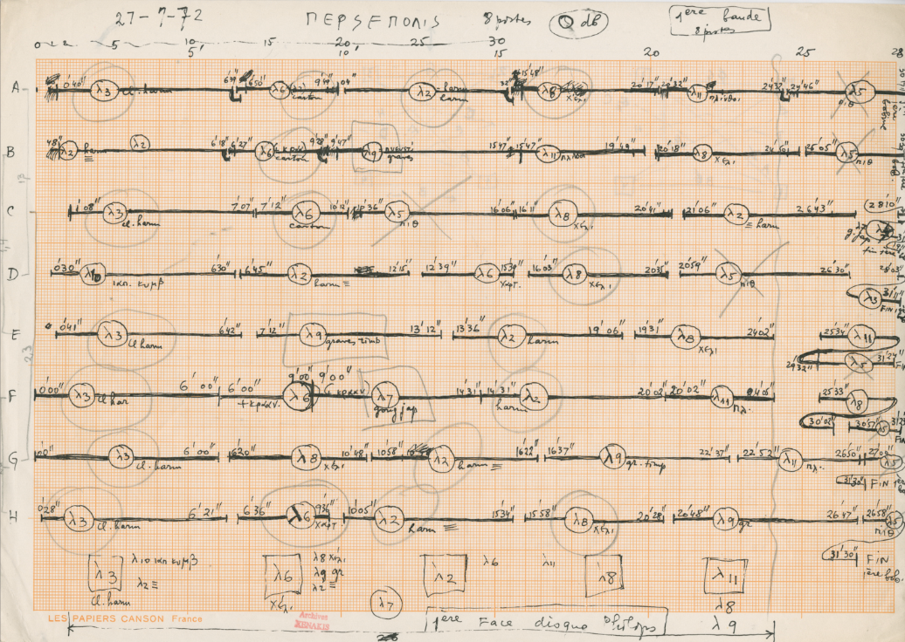
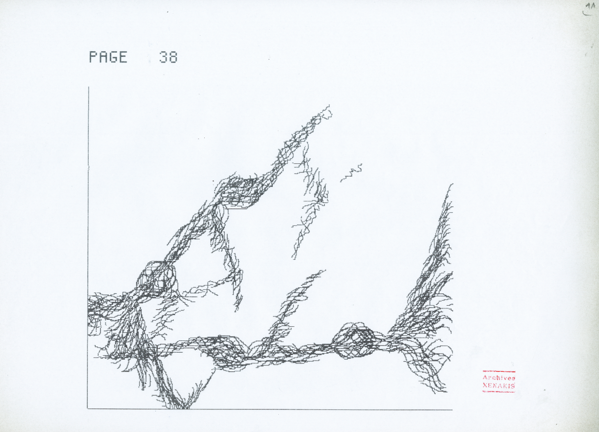

- ## Empty Set
	- #maths #set
	- Reference:
		- [Stack Exchange - Asaf Karagila](https://math.stackexchange.com/a/51756)
		- [Wikipeida](https://www.wikiwand.com/en/Empty_set#introduction)
	- Definition of an empty set:
		- $$\emptyset = \{ x \, | \, x \neq x \}$$
	- Definition of subset:
		- For any set $x$ and $y$, we say $x$ is a subset of $y$ iff
		- $$\forall z \, ( \,z \in x \rightarrow z \in y \, ) \,$$
	- Definition of set equality:
		- For any set $x$ and $y$, we say $x=y$ iff
		- $$\forall z \, ( \,z \in x \leftrightarrow z \in y \, ) \,$$
	- Proof of $\{ \emptyset \} \neq \emptyset$:
		- $z=\emptyset, z \in \{ \emptyset \} \wedge z \notin \emptyset$ (otherwise, $\emptyset$ won't be empty)
-
- ## [[Iannis Xenakis]] electroacoustic works
	- #music #noise #electroacoustic
	- legend: 🟡 - electroacoustic work / 🟢 - details of the work / 🔵 - event/commentary
	- 
		- ((63e03cf1-04b5-41e6-a1e2-1ce44a58efe6))
		-
		- ((63e03d2a-44c2-4970-adac-e736eabbf6bc))
		-
		- ((63e03d48-7b88-44ed-9842-d8819d70cd30))
			- [[Granular-Synthesis]]
			- ((63e04119-3bd4-4cf0-9c75-bb2eb46f789e))
		-
		- ((63e041cc-71fb-4b39-85c6-3b96c39a57b4))
			- ((63e041da-14f8-4a5b-bf83-29f50c6c71f0))
		-
		- ((63e04204-2368-48f6-9941-cd183c104a3f))
		-
		- ((63e0438f-0bda-493e-b03b-d9bd2a319e49))
			- 
			- ((63e04cb0-3ec4-40d3-b4ca-52a5db552405))
				- 
			-
		- ((63e03ec9-9310-40cd-9043-cc5d9846dc44))
			- [[Stochastic Synthesis]]
			- ((63e04515-dca3-44af-bf95-0fa47baae4e9))
				- 
			- ((63e044a0-240f-476f-b972-44c44b9b3281))
			-
		- ((63e04054-9464-49a0-b9c4-b9d754f1d181))
			- ((63e04065-3a9d-4f2d-81ed-e0822a5f49a6))
			- ((63e040a1-779f-4550-9d85-71243eddebb7))
		-
		- ((63e0659e-ec12-4f16-99e8-ec593e52d97a))
		-
		- ((63e0502a-1182-4bec-a1c5-02168b1e0a10))
			- [[May 1968]]
		-
		- ((63e052f3-516a-45c2-8cdc-fad3a287512c))
			- ((63e05320-e5cb-4f46-b055-f08b9ee8636f))
				- 
			- ((63e053a3-180a-4613-b158-cd54fa35c60f))
			- ((63e053ae-3f8e-4bbc-ba52-bc8fb2be8464))
		-
		- ((63e015ef-60db-4fac-a2cf-a2ad1e19b65a))