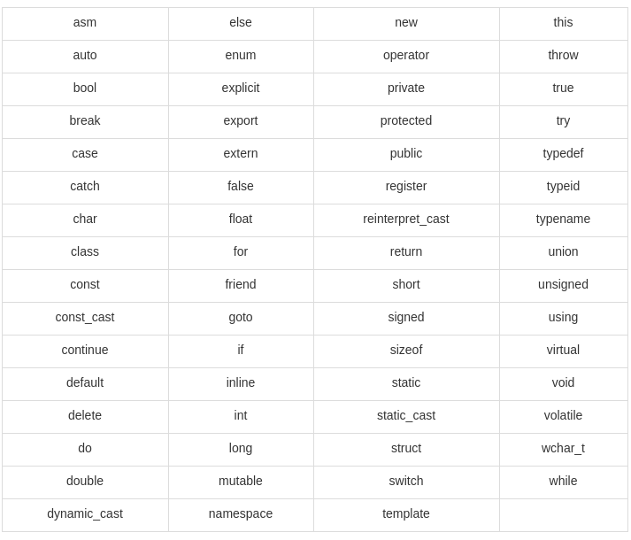
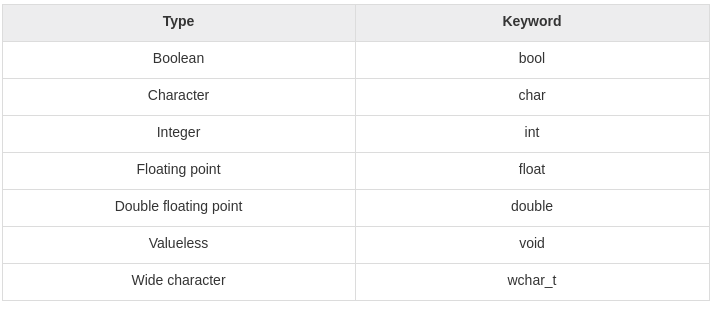
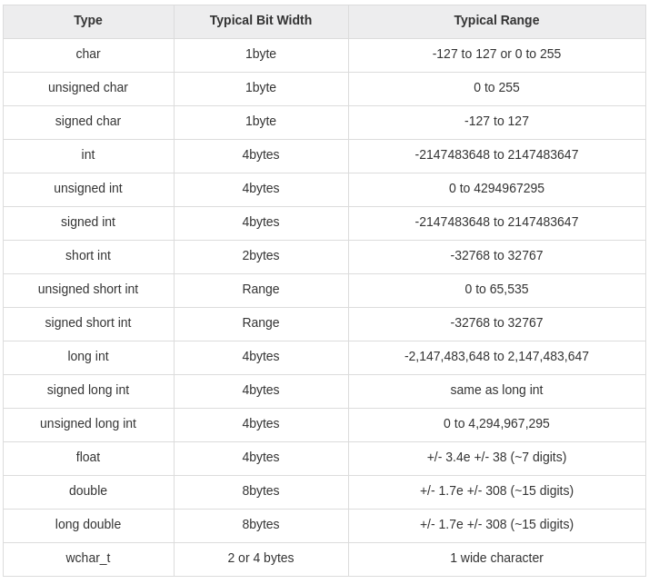

# Tutorials Point

## Table of Contents
- [C++ Basics](#c++-basics)

---
## C++ Basics

### Identifiers
A C++ identifier is a name used to identify a *variable*, *function*, *class*, *module*, or any other user-defined item. An identifier **starts with a letter A to Z or a to z or an underscore (_)** followed by zero or more letters, underscores, and digits (0 to 9).

---
### Reserved Keywords


---
### Primitive Built-in Types


The following table shows the variable types:</br>


---
### Enumerated Types
An enumerated type declares an optional type name and a set of zero or more identifiers that can be used as values of the type. Each enumerator is a constant whose type is the enumeration.</br>
```
enum color { red, green, blue } c;
c = blue;
```

---
### Variable Definition & Declaration
For definition without an initializer: variables with **static storage duration** are implicitly initialized with **NULL** (*all bytes have the value 0*); the initial value of all other variables is **undefined**.

A variable declaration is useful when you are using multiple files and you define your variable in **one of the files** which will be **available** at the time of linking of the program. You will use **extern** keyword to declare a variable at any place.

---
### Lvalues and Rvalues
- Expressions that **refer to a memory location** is called **lvalue** expression. An lvalue may appear as either the left-hand or right-hand side of an assignment.
- The term **rvalue refers to a data value that is stored at some address in memory**. An rvalue is an expression that cannot have a value assigned to it which means an rvalue may **appear on the right- but not left-hand side** of an assignment.

---
### Integer Literals
Following are some examples of various types of integer literals:
```
85         // decimal
0213       // octal
0x4b       // hexadecimal
30         // int
30u        // unsigned int
30l        // long
30ul       // unsigned long
```

---
### Floating-point Literals
A floating-point literal has an **integer part**, **a decimal point**, **a fractional part**, and **an exponent part**. You can represent floating point literals either in decimal form or exponential form.
```
3.14159       // Legal
314159E-5L    // Legal
510E          // Illegal: incomplete exponent
210f          // Illegal: no decimal or exponent
.e55          // Illegal: missing integer or fraction
```

---
### Defining Constants
There are two simple ways in C++ to define constants:
- Using <strong>#define</strong> preprocessor.
- Using **const** keyword.

Note that it is a good programming practice to define **constants** in **CAPITALS**.

---
### Type Qualifiers in C++
- **const**: Objects of type const cannot be changed by the program during execution.
- **volatile**: The modifier volatile tells the compiler that a variable's value may be changed in ways not explicitly specified by the program.
- **restrict**: A pointer qualified by restrict is initially the only means by which the object it points to can be accessed. Only C99 adds a new type qualifier called restrict.

---
### Storage Classes in C++
A storage class defines the scope (visibility) and life-time of variables and/or functions within a C++ Program. These specifiers precede the type that they modify.
- **auto**: the **default** storage class for all local variables. It can **only** be used within functions, i.e. local variables.
- **register**: used to define local variables that **should be stored in a register instead of RAM**. This means that the variable has a maximum size equal to the register size (usually one word) and can't have the unary '&' operator applied to it (as it does not have a memory location). The register should only be used for variables that require quick access such as counters. It should also be noted that defining 'register' does not mean that the variable will be stored in a register.
- **static**: instructs the compiler to keep a local variable in existence during the **life-time of the program** instead of creating and destroying it each time it comes into and goes out of scope. Therefore, making local variables static allows them to **maintain their values between function calls**. The static modifier may also be applied to **global variables**. When this is done, it causes that variable's scope to **be restricted to the file in which it is declared**. In C++, when static is used on a **class data member**, it causes **only one copy** of that member to be shared by **all objects** of its class.
- **extern**: used to give a reference of a global variable that is **visible to ALL the program files**. When you use 'extern' the variable **cannot be initialized** as all it does is point the variable name at a storage location that has been previously defined.