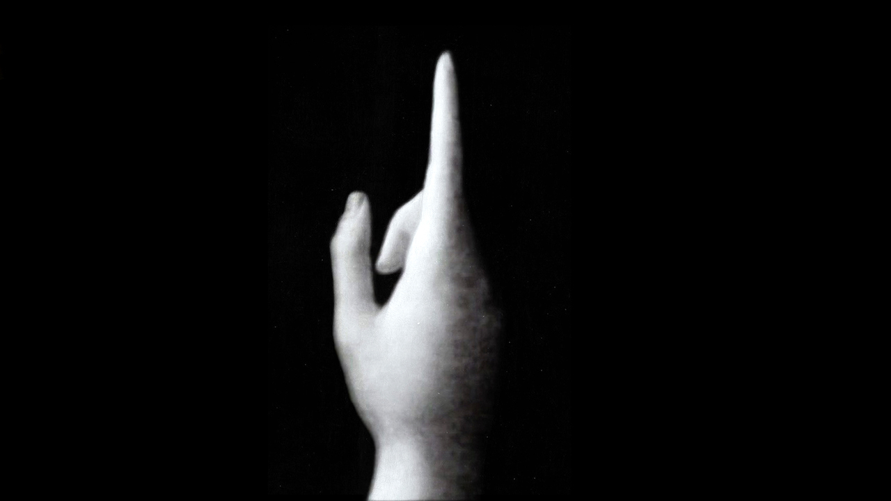

# The Work of Art in the Age of Mechanical Reproduction / 机械复制时代的艺术

## Table of Contents
1. [Foreword](#Foreword)
2. [Chapter I](#I)
3. [Chapter II](#II)
4. [Chapter III](#III)

## Foreword
... In all arts there is a physical component that cannot continue to be considered and treated in the same way as before... Neither matter nor **space** nor **time** is what, up until twenty years ago, it always was. We must be prepared for such profound changes to alter the entire technological aspect of the arts, influencing invention itself as a result, and eventually, it may be, contriving to **alter the very concept of art** in the most magical fashion. -- Paul Valery, Pieces sur l'art.

## I
In principle, the work of art has **always** been reproducible. What man has made, man has always been able to make again...

Technological reproduction of the work of art is something else, something that has been practised intermittently throughout history, at **widely separated intervals** though **with growing intensity**:
- Greeks - casting and embossing: bronzes, terracotta and coins.
- wood engraving: made graphic art technologically reproducible for the first time.
- Middle age - copperplate engraving and etching.
- Early nineteenth century - lithography
- Mere decades after - photography - in the process of pictorial reproduction the ***hand*** was for the first time relieved of the principal artistic responsibilities.

 

Around 1900 technological reproduction had reached a standard at which it had not merely begun to take the totality of tradition artworks as its province, imposing the most profound changes on the impact of such works; it had even gained a place for itself among artistic modes of procedure.

## II
...the **here** and **now** of the work of art -- its unique existence in the place where it is at this moment...

history: 1. physical structure over the course of time 2. the fluctuating conditions of ownership

The here and now of the original constitute the abstract idea of its **genuineness**.

The whole province of genuineness is beyond technological reproducibility. But while in relation to manual reproduction the **genuine** article keeps its full **authority**, in relation to **reproduction** by technological means that is **not** the case:

1. A technological reproduction is **more autonomous**. For example, through photography, it is able to employ techniques like enlargement or slow motion to capture images that are quite simply byond natural optics.
2. It can place the copy of the original in situations **beyond the reach of the original itself**. Above all, it makes it possible for the original to come closer to the person taking it in.

The genuineness of a thing is the quintessence of everything about it since its creation that can be handed down, from its material duration to the historical witness that it bears.

The later is grounded in the former. What happens in the reproduction, where the former has been removed from human perception, is that the latter also starts to wobble. -> The **authority** of the thing starts to wobble.

What shrinks in an age where the work of art can be reproduced by technological means is its <strong style="color:DarkMagenta">aura</strong>.

Reproductive techonology:
1. In making many copies of the reproduction, it substitutes for its unique incidence a **multiplicity** of incidences.
2. In allowing the reproduction to **come** **closer** to whatever situation the person apprehending it is in, it actualizes what is reproduced.

Leads to an upheaval of tradition that is the verso of the current crisis and renewal of mankind. Intimately bound up with the **mass movements** of our day. Their most powerful agent is **film** ... is unthinkable without ... liquidation of the value of tradition in the cultural heritage.

## III
Within major historical periods, along with changes in the overall mode of being of the human collective, there are also changes in the manner of its **sense perception**.

The scholars of the Vienna School, Riegl and Wickhoff ... content themselves with revealing the **formal signatur**e that characterized perception in the late-Roman period. They did not try to reveal the **social upheavals** that found expression in those changes of perception.

If changes in the medium of perception occurring in our own day **may be understood as a** <strong style="color:DarkMagenta">fading of aura</strong>, the **social conditions** of that fading can be demonstrated.

<strong style="color:DarkMagenta">Aura</strong>: **a unique manifestation of a remoteness, however close it may be**.

The **fading** has to do with two circumstances, both of which are connected with the *increasing significance* of the **masses** in present-day life:
1. <strong style="color:orange">'Getting closer to things' in both social and human terms.</strong>
2. <strong style="color:MediumVioletRed">Surmount the uniqueness of each circumstances by seeing it in reproduction.</strong>

The orientation of reality toward the masses and of the masses toward reality is a process of unbounded consequence not only for thought but also for the way we see things.

## IV
The **uniqueness** of the work of art is identical with its embeddedness in the **context of tradition**.

Tradition itself is ... very much *alive*, ... *extraordinarily changeable*. e.g. A classical statue of Venus occupied a different traditional context for Greeks than for medieval clerics.

The original way in the context of tradition was through **worship**: ritual magical -> religious -> completely separated from its ritual function.

The 'one-of-a-kind' value of the '**genuine**' work of art has its underpinning in the **ritual** in which it had its original, initial utility value.

With the advent of the first truly revolutionary means of reproduction, art felt a crisis approaching, it reacted with the theory of `l'art pour l'art` (art for art's sake), which constitutes a theology. It rejected not only any kind of social function but also any pompting by an actual subject.

**Being reproducible by technological means frees the work of art, for the first time in history, from its existence as a parasite upon ritual.**

The instant the criterion of genuineness in art production failed, the entire social function of art underwent an upheaval. Rather than being underpinned by ritual, it came to be underpinned by a different practice: **politics**.

## V
