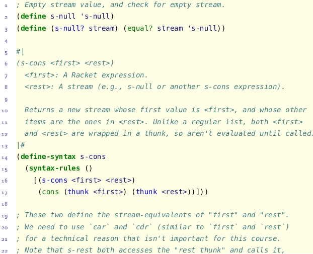
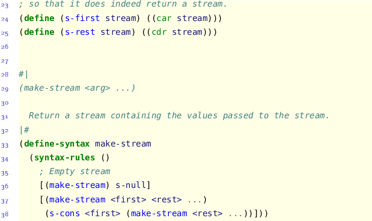
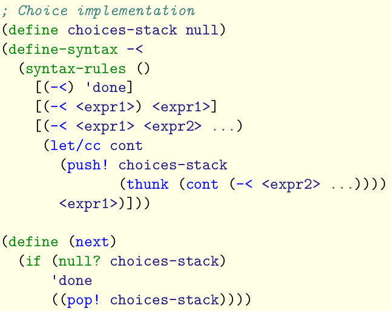

# Manipulating control flow I: streams
Manipulating control flow to circumvent function eager evaluation order in Racket.

In Racket, `cons` is a functon, and so obeys eager evaluation. This means that all lists built up using `cons` are eagerly evaluated i.e. all list elements are evaluated when the list is constructed.

---
### Recursive definition of `stream`
- A stream is either empty or
- A thunk wrapping a **value** `cons` with a thunk wrapping another **stream**.

> we give the name thunk to any nullary function whose purpose is to delay the evaluation of its body expression.

<br>


In Haskell, `cons` is already lazy. So in fact, the list data type in Haskell is actually a stream.

---
# Manipulating control flow II: the ambiguous operator `-<`
The continuation, a representation of the control flow at a given point in the execution of a program.

## `-<`
- `-<` takes an arbitrary number of argument expressions, representing the possible *choices* for the expression.
- If there are no arguments, it returns a special constant `DONE`.
- If there is at least one argument, it **evaluates** and **returns** the value of the first argument. 
- In addition, if there is more than one arguments, `-<` stores a "choice point" that contains the remaining arguments so that they can be accessed, one at a time, by calling a separate function `next`.
- Once all of the arguments have been evaluated, subsequent calls to `next` return `DONE`.


## Continuations
For each subexpression `s`, we say that its **continuation** is a representation of what remains to be evaluated after `s` itself has been evaluated.

---
### `let/cc`: reifying continuations
Continuation is a **first-class** data type in Racket.

Racket reifies continuations, meaning exposes continuations as values that a program and access and manipulate as easily as numbers and lists.

```
(let/cc <id> <body>)
```
A `let/cc` expression has the following denotational semantics:
- the value of a `let/cc` expression is equal to the value of the `<body>` expression.
- `<id>` is bound to the *continuation* of the `let/cc` expression.

Note: we can use the same syntax as function calls i.e. `(<cont> <arg>)`. Remember, continuations always take just **one argument**, the value of the "result" to put into the underscore.

---
### Calling continuations vs. calling functions
```
> (f 4)
13

> (global-cont 4)
13

> (+ 1 (f 4))
14

> (+ 1 (global-cont 4))
13
```
Calling a continuation **discards** the enclosing continuation, and replaces it with the continuation being called.

---
### Branching choices
Every time we encounter a choice expression, we *push* the corresponding thunk onto the choice stack, and every time we call `next`, we *pop* off the stack and call it.



---
### Backtracking
```
(define (?- pred expr)
    (if (pred expr)
        expr
        (next)))
```
Here, we *automatically backtrack* on failures.


# Type systems
A **type system** is the set of rules in a programming language governing the semantics of types in the language.

---
### `Strong` typing vs. `weak` typing
In a `strongly-typed` language, every value has a fixed type at every point during the execution of a program.

A `weakly-typed` language has no such guarantees: values can be implicitly interpreted as having a completely different type at runtime than what was originally intended, e.g. `"5" + 6` is semantically valid in many languages.

---
### `Static` typing vs. `dynamic` typing
In a `statically-typed` language, the type of every expression is determined directly from the source code, before any code is actually executed.

In contrast, `dynamically-typed` languages do not perform any type-checking until the program is run.

---
### The basics of Haskell's type system
> One important difference between Haskell and Racket is that lists must contain values of the same type, so the expression `[True, 'a']` is rejected by Haskell. This also applies to `if then else` expression.

---
### Function types and currying
Haskell treats **all** functions as unary functions, and that function application is indicated by simply seperating two expressions with a space.

---
### Algebraic data types
We call types that are created using combinations of constructors and unions **algebraic data types**.

---
## Definition of polymorphism
In programming language theory, **polymorphism** refers to the ability of an entity (e.g. function or class) to have valid behavior in contexts of different types.
- If a function's type signature is **concrete** i.e. no type variables, it is **not polymorphic**.
- If a function's type signature contains an **unconstrained type variable**, it is **generically polymorphic** i.e. the function **must** behave the same way for any type instantiation of that variable.
- If we have a **constrained type variable** in a function type signature, it is **ad hoc polymorphic** i.e. the ability of an entity to have **different** behaviours depending on the type context.

---
### Polymorphism I: type variables and generic polymorphism
A **type variable** is an **identifier** in a type expression that can be instantiated to any type.

A **type constructor** is a **function** that takes type variable(s) and creates a new type.

For example, when we type-check the expression `head [True, False, False]`:
1. Haskell determines that the type of the argument is `[Bool]`.
2. Haskell matches the argument type `[Bool]` against the parameter type `[a]`, and instantiates the type variable `a = Bool` in the function type.
3. Haskell takes the return type `a`, with `a` instantiated to `Bool`, to recover the final concrete type `Bool` for the return type.

---
### Generic polymorphism (in Haskell and beyond)
In Haskell, lists are an example of **generic polymorphism**, a form of polymorphism in which an entity (e.g., function or class) behaves in the **same way** regardless of the type context. (e.g. list can store elements of any type. Similarly, almost every built-in list function is generic, meaning they operate on their input list regardless of what this input list contains.)

---
### Polymorphism II: Type classes and ad hoc polymorphism
A **type class** is a set of types plus a set of functions that must work on these types, similar to the notion of an abstract interface in OOP.

A type is a **member** of a type class if the type class' functions have been implemented for that type.

```Haskell
> :t show
show :: Show a => a -> String
```
We call the `show a` before the `=>` a **type class constraint**: its meaning is that the type variable `a` can only be instantiated to a member of the `show` type class. 

We say that type variable `a` is a **constrained type variable**, because the presence of this constraint. 

---
### Ad hoc polymorphism
In contrast to generic polymorphism, **ad hoc polymorphism** is the ability of an entity to have **different** behaviour depending on the type context.

In Haskell, this is precisely what type classes give us. By making types an instance of a type class, we give different implementations of the same function for each type seperately, e.g. when we see `show a =>`, we expect different behaviours for the function for different instantiations of `a`.

`Functor` in Haskell is a built-in "mappable" type class:
```Haskell
class Functor f where
    -- the "f" in fmap stands for "Functor"
    fmap :: (a -> b) -> f a -> f b
```
Here, the type variable `f` represents the member of `Functor`, but we can tell from the type signature of `fmap` that `f` is **not** a primitive type like *Int* or *Bool*, but instead a type constructor like the `[]`, `Vector`, or `Set`.

---
### Representing failing computations
We can indicate in our program where potentially failing computations might occur, and make this known to the compiler by defining a data type representing the result of a computation that may or may not have been successful.
```Haskell
data Maybe a = Nothing | Just a
```

---
### Composing failing computations
```Haskell
safeSecond :: [a] -> Maybe a
safeSecond xs =
    let xs' = safeTail xs
    in
        case xs' of
        Nothing -> Nothing
        (Just xs'') -> safeHead xs''
```
- `xs` has type `[a]`.
- `xs'` has type `Maybe [a]`.
- `xs''` has type `[a]`.

To generalize, we move the pattern-matching to a helper function:
```Haskell
andThen :: Maybe a -> (a -> Maybe b) -> Maybe b
andThen Nothing _ = Nothing
andThen (Just x) f = f x
```

We can use backticks to call `andThen` from an infix position:
```Haskell
safeSecond :: [a] -> Maybe a
safeSecond xs =
    let xs' = safeTail xs
    in
        xs' `andThen` safeHead

safeFourth :: [a] -> Maybe a
safeFourth xs =
    safeTail xs `andThen`
    safeTail `andThen`
    safeTail `andThen`
    safeHead
```

---
### Stateful computations
```Haskell
data State s a = State (s -> (a, s))
```
In Haskell, `State` type constructor doesn't refer to the state itself, but rather to a *stateful computation* that takes in and returns state.

```Haskell
get :: State s s
get = State (\state -> (state, state))

put :: s -> State s ()
put item = State (\state -> ((), item))
```
- `get` takes the old state and returns its value as both elements of the tuple. The *first* element represents what's being produced (the value if looked up), while the *second* represents the new state, which is actually exactly the same as the old state.
- `put` updates the state, which is why the *second* element in the returned tuple is `item` -- the old state has been replaced. The `()` in the *first* position is called **unit** in Haskell, and is used to denote the fact that the `put` doesn't produce a value. This is analogous to a `void` return type in Java or C.

---
### Running and combining stateful computations
```Haskell
runState :: State s a -> (s -> (a, s))
runState (State op) = op
```
It means that we can call `runState` on both a `State` and a state value, essentially "running the stateful computation on the given initial state",
e.g. `runState get 5` returns `(5, 5)`.

We can now chain together stateful computations as well.
```Java
public String f() {
    int x;
    x = 10;
    x = x * 2;
    return str(x);
}
```
which can be translated to:
```Haskell
f :: State Int String
f = State (\state0 ->
    let (_, state1) = runState (put 10) state0
        (x, state2) = runState get state1
        (_, state3) = runState (put (* x 2)) state2
        (x', state4) = runState get state3
    in
        (show x', state4)
    )
```

---
```Haskell
andThen :: State s a -> (a -> State s b) -> State s b
andThen op1 opMaker = State (\state0 ->
    let (x1, state1) = runState op1 state0
        op2 = opMaker x1
        (x2, state2) = runState op2 state1
    in
        (x2, state2)
    )
```
That is, `andThen` does the following:
1. Run its first `State` computation.
2. Use the produced result (`x1`) and its second argument (`opMaker`) to create a second `State` computation.
3. Run the newly created `State` computation, and return the result (and updated-state).

```Haskell
f :: State Int String
f = (put 10) `andThen` \_ ->
    get `andThen` \x ->
    (put (* x 2)) `andThen` \_ ->
    get `andThen` \y ->
    State (\state -> (show y, state))
```

---
### Post-order labeling
First, here is the corresponding data type we'll use to represent binary trees in Haskell.
```Haskell
data BTree a = Empty
                -- The Int parameter is the label
                | Node a Int (BTree a) (BTree a)
```

The python mutating version:
```Python
i = 0

def postOrderLabel(tree):
    global i

    if tree.is_empty():
        return
    else:
        postOrderLabel(tree.left)
        postOrderLabel(tree.right)
        tree.root.label = i
        i += 1
```
The corresponding Hasekll mutating translation:
```Haskell
postOrderLabel :: BTree a -> State Int (BTree a)
postOrderLabel Empty = State (\state -> (Empty, state))
postOrderLabel (Node item _ left right) = 
    postOrderLabel left `andThen` \newLeft ->
    postOrderLabel right `andThen` \newRight ->
    get `andThen` \i ->
    put (i + 1) `andThen` \_ ->
    State (\state -> ((Node item i newLeft newRight), state))
```

---
### Performing I/O
- Functions receiving **external input** are **impure** because their behaviour changes each time they are run.
- Functions writing to some **output** are **impure** because they have *side effect*.
  
We can think **pure** functions as those that have **no context** (e.g. external mutable state) they need to reference, and impure functions as those they do.

---
### Standard I/O primitives
```Haskell
> :t getLine
getLine :: IO String
> :t putStrLn
putStrLn :: String -> IO ()
```
- `IO` is a unary type constructor, where the type `IO a` represents an I/O action that produces a value of type `a`.
- `getLine` has type `IO String` because it is an I/O action that produces a string.
- `putStrLn` has type `String -> IO ()` because it takes a string, print it out, but produces nothing.

Chain together two I/O actions:
```Haskell
-- andThen, but discard the result produced by the first
-- By convention, called "then"
(>>) :: IO a -> IO b -> IO b

-- andThen, using the first result to create the second
--- By convention, called "bind"
(>>=) :: IO a -> (a -> IO b) -> IO b
```

Example:
```Haskell
prompt2 :: IO ()
prompt2 =
    putStrLn "What's your name?" >>
    getLine >>= \name ->
    putStrLn "Nice to meet you, " ++ name ++ "!"

> prompt2
What's your name?
David -- This line is user input.
Nice to meet you, David!
```

---
#### Types as constraints
A type signature in Haskell tells us not just how to use a function and what it returns, but what it **cannot do** as well, e.g. any Haskell function that uses standard I/O must have a IO in its type.

---
### One last abstraction: monads
Monads include:
- Failing computations
- Stateful computations
- I/O computations
  
**Monad** serves to **abstract away** how we computed on the types, allowing us to **elegantly** compose primitive values of these types to express **complex computations**.

Type signatures for three types above:
```Haskell
-- failing computation i.e. Maybe
andThen :: Maybe a -> (a -> Maybe b) -> Maybe b
-- stateful computation i.e. State
andThen :: State s a -> (a -> State s b) -> State s b
-- i/o computation i.e. IO
(>>=) :: IO a -> (a -> IO b) -> IO b
```

Using monad to abstract away:
```Haskell
class Monad m where
    return :: a -> m a
    (>>) :: m a -> m b -> m b
    (>>=) :: m a -> (a -> m b) -> m b 
```
- `return`: take some pure value, and "wrap" it in the monadic context.
- `(>>)`: chain together two monadic values, the result **cannot** depend on the result of the first one.
- `(>>=)`: chain together two monadic values, the result **can** depend on the result of the first one.

---
In the `I/O` context:
- `return`: create an I/O action which does nothing except produces the given value.
- `(>>)`: combine two I/O actions into a new I/O action which performs the two in sequence, produce the result of the second.
- `(>>=)`: create a new I/O action which performs the first one, takes the result and uses it to create a second action, and then performs that second action.

---
In the `Maybe` context:
```Haskell
instance Monad Maybe where
    -- return
    return = Just
    
    -- then
    Nothing >> _ = Nothing
    (Just _) >> x = x
    
    -- bind
    Nothing >>= _ = Nothing
    (Just a) >>= f = f a
```
While the "bind" and "return" should looks familiar, then "then" operator is new, although it makes sense: it returns the second `Maybe` only when the first one is a success.

---
### Why monads?
The common set of operations -- `return`, `(>>)`, and `(>>=)` -- are powerful enough to serve as building blocks for much more complex, generic operations.

For example:
```Haskell
seqM :: [m a] -> m [a]
seqM [] = return []
seqM (m1:ms) = 
    -- extract the first value
    m1 >>= \x ->
    -- extract the other values
    seqM ms >>= \xs ->
    return (x:xs)
```
The **Monad** type class is simply a tool that you can use to design far more generic code than you probably have in other languages.