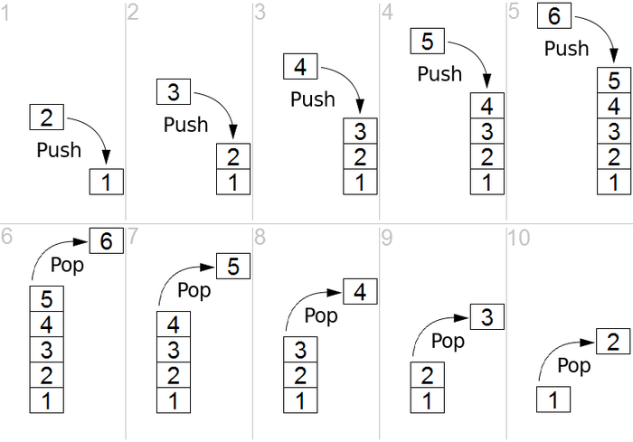

# Stack & Queue

- [Stack & Queue](#stack--queue)
  - [Stack](#stack)
    - [Performance](#performance)
  - [Queue](#queue)
    - [Performance](#performance-1)
  - [Leetcode](#leetcode)

---
## Stack
Stack is a **linear data structure** which follows FILO in which the operations are performed:

### Performance
- push: O(1)
- pop: O(1)

---
## Queue
A Queue is a **linear structure** which follows FIFO in which the operations are performed. The difference between [stacks](#stack) and queues is in **removing**. In a stack we remove the item the most recently added; in a queue, we remove the item the least recently added.

### Performance
- enqueue: O(1)
- dequeue: O(1)

---
## Leetcode
- [Leetcode 题解](https://github.com/CyC2018/CS-Notes/blob/master/notes/Leetcode%20%E9%A2%98%E8%A7%A3%20-%20%E6%A0%88%E5%92%8C%E9%98%9F%E5%88%97.md)
- [My solutions](https://github.com/modalsoul0226/LeetcodeRepo/tree/master/stack.queue)
