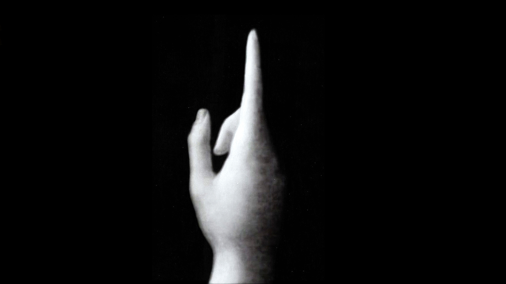

<link href="https://fonts.googleapis.com/css2?family=Roboto:wght@100;300;400&display=swap" rel="stylesheet">

# The Work of Art in the Age of Mechanical Reproduction / 机械复制时代的艺术 / Walter Benjamin

## Table of Contents
- [Foreword](#Foreword)
- [Chapter I](#I)
- [Chapter II](#II)
- [Chapter III](#III)
- [Chapter IV](#IV)
- [Chapter V](#V)
- [Chapter VI](#VI)
- [Chapter VII](#VII)
- [Chapter VIII](#VIII)
- [Chapter IX](#IX)
- [Chapter X](#X)
- [Chapter XI](#XI)
- [Chapter XII](#XII)
- [Chapter XIII](#XIII)
- [Chapter XIV](#XIV)
- [Chapter XV](#XV)
- [Afterword](#Afterword)

## Foreword
... In all arts there is a physical component that cannot continue to be considered and treated in the same way as before... Neither matter nor **space** nor **time** is what, up until twenty years ago, it always was. We must be prepared for such profound changes to alter the entire technological aspect of the arts, influencing invention itself as a result, and eventually, it may be, contriving to **alter the very concept of art** in the most magical fashion. -- Paul Valery, Pieces sur l'art.

## I
In principle, the work of art has **always** been reproducible. What man has made, man has always been able to make again...

Technological reproduction of the work of art is something else, something that has been practised intermittently throughout history, at **widely separated intervals** though **with growing intensity**:
- Greeks - casting and embossing: bronzes, terracotta and coins.
- wood engraving: made graphic art technologically reproducible for the first time.
- Middle age - copperplate engraving and etching.
- Early nineteenth century - lithography
- Mere decades after - photography - in the process of pictorial reproduction the ***hand*** was for the first time relieved of the principal artistic responsibilities.

 

Around 1900 technological reproduction had reached a standard at which it had not merely begun to take the totality of tradition artworks as its province, imposing the most profound changes on the impact of such works; it had even gained a place for itself among artistic modes of procedure.

## II
...the **here** and **now** of the work of art -- its unique existence in the place where it is at this moment...

history: 1. physical structure over the course of time 2. the fluctuating conditions of ownership

The here and now of the original constitute the abstract idea of its **genuineness**.

The whole province of genuineness is beyond technological reproducibility. But while in relation to manual reproduction the **genuine** article keeps its full **authority**, in relation to **reproduction** by technological means that is **not** the case:

1. A technological reproduction is **more autonomous**. For example, through photography, it is able to employ techniques like enlargement or slow motion to capture images that are quite simply byond natural optics.
2. It can place the copy of the original in situations **beyond the reach of the original itself**. Above all, it makes it possible for the original to come closer to the person taking it in.

The genuineness of a thing is the quintessence of everything about it since its creation that can be handed down, from its material duration to the historical witness that it bears.

The later is grounded in the former. What happens in the reproduction, where the former has been removed from human perception, is that the latter also starts to wobble. -> The **authority** of the thing starts to wobble.

What shrinks in an age where the work of art can be reproduced by technological means is its <strong style="color:DarkMagenta">aura</strong>.

Reproductive techonology:
1. In making many copies of the reproduction, it substitutes for its unique incidence a **multiplicity** of incidences.
2. In allowing the reproduction to **come** **closer** to whatever situation the person apprehending it is in, it actualizes what is reproduced.

Leads to an upheaval of tradition that is the verso of the current crisis and renewal of mankind. Intimately bound up with the **mass movements** of our day. Their most powerful agent is **film** ... is unthinkable without ... liquidation of the value of tradition in the cultural heritage.

## III
Within major historical periods, along with changes in the overall mode of being of the human collective, there are also changes in the manner of its **sense perception**.

The scholars of the Vienna School, Riegl and Wickhoff ... content themselves with revealing the **formal signatur**e that characterized perception in the late-Roman period. They did not try to reveal the **social upheavals** that found expression in those changes of perception.

If changes in the medium of perception occurring in our own day **may be understood as a** <strong style="color:DarkMagenta">fading of aura</strong>, the **social conditions** of that fading can be demonstrated.

<strong style="color:DarkMagenta">Aura</strong>: **a unique manifestation of a remoteness, however close it may be**.

The **fading** has to do with two circumstances, both of which are connected with the *increasing significance* of the **masses** in present-day life:
1. <strong style="color:orange">'Getting closer to things' in both social and human terms.</strong>
2. <strong style="color:MediumVioletRed">Surmount the uniqueness of each circumstances by seeing it in reproduction.</strong>

The orientation of reality toward the masses and of the masses toward reality is a process of unbounded consequence not only for thought but also for the way we see things.

## IV
The **uniqueness** of the work of art is identical with its embeddedness in the **context of tradition**.

Tradition itself is ... very much *alive*, ... *extraordinarily changeable*. e.g. A classical statue of Venus occupied a different traditional context for Greeks than for medieval clerics.

The original way in the context of tradition was through **worship**: ritual magical -> religious -> completely separated from its ritual function.

The 'one-of-a-kind' value of the '**genuine**' work of art has its underpinning in the **ritual** in which it had its original, initial utility value.

With the advent of the first truly revolutionary means of reproduction, art felt a crisis approaching, it reacted with the theory of `l'art pour l'art` (art for art's sake), which constitutes a theology. It rejected not only any kind of social function but also any pompting by an actual subject.

**Being reproducible by technological means frees the work of art, for the first time in history, from its existence as a parasite upon ritual.**

The instant the criterion of genuineness in art production failed, the entire social function of art underwent an upheaval. Rather than being underpinned by ritual, it came to be underpinned by a different practice: **politics**.

## V
Works of art are received and appreciated with different points of emphasis: 
- **cultic value**: the work's presence is more important than the fact that it is seen.

As individual instances of artistic production become emancipated from the context of religious ritual, opportunities for displaying the products increase.

- **display value**: capable of being dispatched hither and thither.

Because of the absolute weight placed on its display value instead of cultic value, the work of art is becoming an image with entirely new functions, namely the artisitic function, stands out as one that may subsequently be deemed incidental.

## VI
In photography, display value starts to drive cultic value back along the whole line.

In human portrait, the cultic value of the image finds its last refuge. But when the human form withdraws from photography, there for the first time display value gets the better of cultic value.

With [Atget](https://www.wikiwand.com/en/Eug%C3%A8ne_Atget), photographs become exhibits in the trial that is **history**. That is what constitutes their hidden political significance. They already call for a specific type of reception. Free-floating comtemplation is no longer an appropriate reaction here. In them the **caption first became obligatory**. 

The caption become even **more precise and imperious in film**, where the way in which each individual image is apprehended appears to be dictated by the sequence of all that have gone before.

## VII
The clash fought out during the nineteenth century as painting and photography disputed the artistic merits of their respective products was the expression of a **historical upheava**l.
<strong style="color:orange">The age where art became reproducible by technological means, in setting it free from its cultic roots, extinguished the light of its autonomy for ever.</strong> Yet the alteration in the function of art thus engendered dropped from the century's field of view.

Much wisdom had already been thrown away on trying to decide whether photography was an art (**without asking the prior question: whether, with the invention of photography, the very nature of art had undergone a chnage**), but before long the theoreticians of film were asking a similarly hasty question.

It is most instrcutive to see how the **endeavour to annex film to 'art' requires** critics to throw caution to the winds in reading **cultic elements** into their subject.

What is characteristic is that, still today [i.e. 1936], particularly reactionary writers seek the meaning of film along the same lines, finding it not in the sacred, perhaps, but certainly in the supernatural.

## VIII
The artistic performance the **stage actor** is presented to the audience by the actor **in person**.

The artistic performance of the **screen actor**, on the other hand, is presented to the audience **via a piece of equipment, a film camera**.

The latter has two consequences:
1. The apparatus that mediates the performance of the screen actor to the audience is not obliged to respect that performance as an entity, i.e. **screen actor's performance is mediated by the camera**.
2. The screen actor is deprived of the possibility open to the stage actor of adapting that performance to the audience as the show goes on, and audience empathizes with the performer only by empathizing with the camera.

## IX
"The screen actor," [Pirandello](https://www.wikiwand.com/en/Luigi_Pirandello) writes, "feels as if exiled. Exiled not only from the stage but from his own person. With dim disquiet he senses the inexplicable emptiness that results from his body becoming a withdrawal symptom, from its dissipating and being robbed of its reality, its life, its voice, and the sound it makes by moving around, reduced to a mute image that flickers on the screen for an instant, then disappears into thin air ..."

**For the first time a person is placed in the position, while operating with his whole being, of having to dispense with the aura that goes with it.** For that aura is bound to his **here and now**, it has no replica.

The aura surrounding Macbeth onstage cannot, for the live audience, be detached from the aura that surrounds the actor playing him. But when filming in studio, the audience is replaced by a piece of equipments. The aura surrounding the player must thus be lost - and with it, at the same time, the aura around the character played.

The ultimate developments being to treat the actor as a prop that is selected for character and ... put to use in the right place.

An actor working in the theatre enters into a part. Very often, the screen actor is now allowed to. The latter's performance is **not a single entity**; it consists of many individual performances. Basic mechanical requirements break the screen actor's performance down into a series of episodes that can then be assembled.

## X
The actor's alienation in front of the film camera, as Pirandello describes it, is inherently of the same sort as a person's feeling of surprise and displeasure when confronted with his mirror-image.

Film's response to the shrivelling of aura is an artificial inflation of 'personality' outside the studio. The cult of stardom promoted by film capital preserves the magic of personality that for years has lain solely in the rancid magic of its commodity character.

While film capital sets the tone, no other revolutionary service can be ascribed to present-day film in general than that of **furthering a revolutionary critique of traditional notions of art**.

For centuries the situation in literature was such that a small number of writers faced many thousands if times that number of readers. Then towards the end of the last century, the distinction between writer and readership loses its fundamental character. The **reader is constantly ready to become a writer**. Literary authority is no longer grounded in specialist education but in polytechnic education; it has become **common property**.

Shifts that in literature took centuries have occurred within a decade for film. The film industry has every interest in arousing the participation of the masses by means of illusory presentation and suggestive speculations.

## XI
A film, particularly a sound film portrays an event that can no longer be assigned to a single standpoint from which things not strictly belonging to the performance process as such (camera, lighting equipment, crew and so on) would not fall within the spectator's field of view.

This fact, more than any other, renders any similarities that may exist between a scene in the film studio and a scene onstage superficial and quite unimportant.

In the film studio the camera has penetrated so deeply into reality that the pure aspect of the latter, uncomtaminated by the camera, emerges from a special procedure, namely being shot by a piece of photographic equipment specifically adapted for the purpose and then pasted together with other shots of the same kind. **The camera-free aspect of reality is here at its most artificial**.

---
#### Magician <-> Surgeon == Painter <-> Cameraman
The magician matains the natural distance between himself and the patient; to be precise, he reduces it only slightly (by virtue of laying-on of hands) while increasing it (by virtue of his authority) hugely. The surgeon does the opposite: he reduces the distance to the patient a great deal (by actually going inside him) and increases it only a little (through the care with which his hand moves among the latter's organ).

**Unlike the magician, the surgeon abstains at the crucial moment from facing his invalid person to person, invading him sugically instead.**

The **painter**, while working, **observes a natural distance from the subject**; the **cameraman**, on the other hand, **penetrates deep into the subject's tissue**. The images they both come up with are enormously different. The painter's is an **entity**, the cameraman's chopped up into a large number of **pieces**, which find their way back together by following a new law. This is why filmic portrayal of reality is of such incomparably greater significance to people today, because it continues to provide the camera-free aspect of reality that they are entitled to demand of a work of art precisely by using the camera to penetrate that reality so thoroughly.

## XII
The fact that the work of art can now be reproduced by technological means **alters the relationship of the mass to art**. From being very backward (faced with a Picasso), it has become extremely progressive (given Chaplin).

The more the social siginificance of an art diminishes, the greater the extent to which the critical and pleasure-seeking stances of the public diverge. In the cinema, the critical and pleasure-seeking stances of the audience conincide.

A **painting** always had an exellent claim to being looked at by one person or a small number. The kind of **simultaneous viewing** of paintings by large crowds that occurs in the nineteenth century is an early sympton of the **crisis** affecting painting, which is **triggered by the work of art laying claim to mass attention**.

The fact is, painting is not able to form the object of simultaneous reception by large numbers of people, as architecture has always been, as the epic once was, and as film is today.

This fact counts as a severe setback when it, in defiance of its nature, finds itself face with the masses.

## XIII
Film has indeed enriched our perceptual world with methods that can be illustrated by those of **Freudian** theory.

Fifty years ago, a conversational slip went more or less unnoticed. Its suddenly revealing depths in what had previously seemed a superficial discussion was probably regarded as an exception. Since *The Psychopathology of Everyday Life* [1901], that has changed.

Film has resulted in a similar deepening of appreciation across the whole optical (and now also acoustic) segment of the sensory world.

Compared with painting, it is the infinitely **more detailed presentation** of the situation that gives the performance portrayed on the screen its **greater analysability**. Compared with live theatre, the greater analysability of the performance portrayed cinematically is due to a **higher degree of isolability**.

That fact tends to foster the interpenetration of art and science. It will count among the revolutionary functions of film that it renders the artistic and scientific uses of photography, which beforehand generally diverged, recognizably identical.

The **close-up** expands space as the **slow-motion** sequence dilates movement. And just as **enlargement** is not really concerned with simply clarifying what we glimpse 'anyway' but rather brings out wholly new structural formations in matter, neither does the **slow-motion** technique simply bring out familiar movement motifs but reveals in them others that are quite unfamiliar and that 'bearr no resemblance to decelerations of rapid movements but are like strangely gliding, floating, supernatural ones'.

... Here the camera intervenes with its different aids, its plunging and soaring, its interrupting and isolating, its stretching and condensing of the process, its close-ups and its diatance shot. Only the **camera** can show us the **optical unconscious**, and it is only through **psychoanalysis** that we learn of the **compulsive unconscious**.

## XIV
It has always been among art's most important functions to generate a **demand** for whose full satisfaction the time has not yet come. The history of every art form has critical periods in which **that form strives for effects that are able to find expression without effort only when technology has reached a new level** - that is to say, in a new art form. (e.g. **Daddaism** was trying to generate the effects that people now look for in film, but using the tools of painting (sometimes literature).

Any radically new, pioneering generation of demands will go too far. Dadaism does so to the point of scrificing the market values that film possesses in such abundance in favour of more significant intention. **The commercial marketability of their works of art meant far less to the Dadaists than their non-marketability as objects of contemplative immersion**, that unrealizable quality, not least by fundamentally disparaging their material. What they achieve by such means is the **ruthless destruction of the aura** of their output, which they use the means of production to stamp as 'reproduction'.

Dadaist demonstrations did indeed constitute a very violent diversion in that they placed the work of art at the centre of a scandal. That work had above all to meet one requirement: it must provide **public irritation**. In the hands of the Dadaists the work of art from being a sight that seduced the eye or a sound that persuaded the ear, became a **bullet**.

Painting invites the viewer to contemplate; he is able, in front of it, to give himself up to his chain of associations. Watching a film, he cannot do this. Scarecely has he set eyes on it before it is already different. It cannot be pinned down.

## XV
Tha mass is a matrix from which currently all customary response to works of art are springing newborn. Quantity has now become quality: the very much greater masses of participants have produced a changed kind of participation.

Such participation initially appears in a disreputable form. Duhamel has spoken most radically. What he blames film for mainly is the nature of the participation it arouses amongst the masses. Clearly, this is at bottom the old charge that the masses are looking for **distraction** whereas art calls for **immersion** on the viewer's part.

Distraction and immersion constitute opposites, enabling us to say this: The person who stands in contemplation before a work of art immerses himself in it; The distracted mass, on the other hand, absorbs the work of art into itself.

**Architecture** has always provided the prototype of a work of art that is received in a state of distraction and by the collective. Buildings have been with mankind since its earliest history. Many forms of art have come and gone (e.g. tragedy, epic, panel painting). The art of building has never lain fallow. Its history is longer than that of any other art, and imaginatively recalling its effect is important as regards any attempt to form a conclusion about how the masses relate to art.

Buildings are received twofold: through how they are used and how they are perceived i.e. in a tactile fashion and in an optical fashion.

