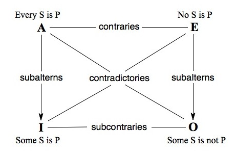

\tableofcontents

# A History of Logic

## Aristotle (384 ~ 322 B.C.)

### The Square of Opposition

The square of opposition is a group of theses embodied in a diagram.
The theses concern logical relations among four logical forms:

|Name|Form|Title|
|:--:|:--:|:----|
|**A**|Every $S$ is $P$|Universal Affirmative|
|**E**|No $S$ is $P$|Universal Negative|
|**I**|Some $S$ is $P$|Particular Affirmative|
|**O**|Some $S$ is not $P$|Particular Negative|

\[\begin{tikzcd}
	{\text{Every S is P}} & {\textbf{A}} &&&& {\textbf{E}} & {\text{No S is P}} \\
	\\
	&&& {\text{contradictories}} \\
	\\
	{\text{Some S is P}} & {\textbf{I}} &&&& {\textbf{O}} & {\text{Some S is not P}}
	\arrow[no head, from=1-2, to=3-4]
	\arrow[no head, from=3-4, to=1-6]
	\arrow["{\text{subalterns}}"{description}, from=1-2, to=5-2]
	\arrow["{\text{subalterns}}"{description}, from=1-6, to=5-6]
	\arrow["{\text{subcontraries}}"{description}, no head, from=5-2, to=5-6]
	\arrow[no head, from=5-2, to=3-4]
	\arrow[no head, from=5-6, to=3-4]
	\arrow["{\text{contraries}}"{description}, no head, from=1-2, to=1-6]
\end{tikzcd}\]
<!-- *  -->

## Chrysippus (279 ~ 206 B.C.)

### Connective Logic

* $\cap, \quad \wedge, \quad \rightarrow$

